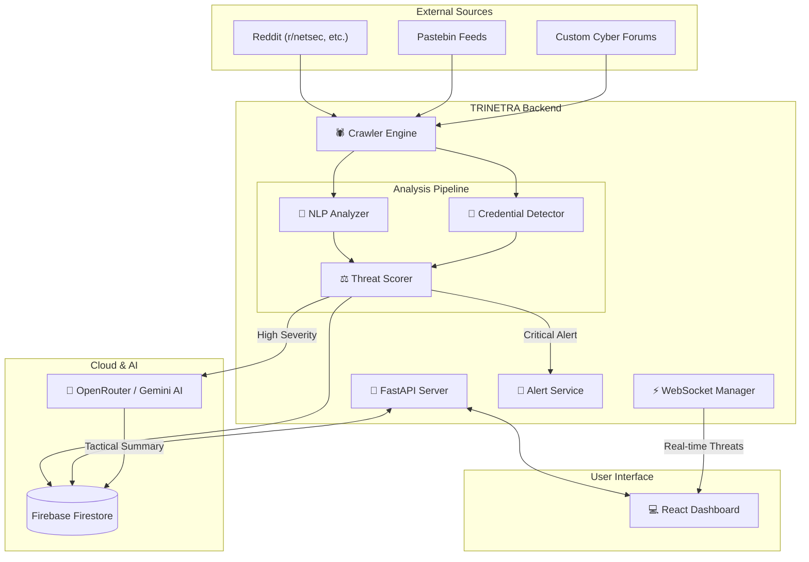

# 🛡️ TRINETRA - Advanced Threat Intelligence Platform


**TRINETRA** is a sophisticated **Threat Intelligence Platform (TIP)** designed to proactively monitor, detect, and analyze cyber threats targeting Indian critical infrastructure. It acts as a central nervous system that scrapes data from various sources, applies rule-based and AI-driven analysis, and provides real-time actionable intelligence.

---

## 🏗️ System Architecture

Trinetra follows a modular microservices-like architecture, separating data ingestion (Crawler), analysis (NLP/Regex), and presentation (Frontend).



---

## ⚡ Threat Detection Workflow

The core of Trinetra is its automated analysis pipeline, which processes every piece of scraped content in real-time.

```mermaid
sequenceDiagram
    participant Source as Data Source
    participant Scraper as Crawler Engine
    participant Analyzer as Analysis Pipeline
    participant DB as Firestore
    participant AI as AI Service
    participant Dashboard as Frontend UI
    participant Alert as Telegram/Email

    Source->>Scraper: New Post / Paste Fetched
    Scraper->>Analyzer: Send Raw Content
    
    rect rgb(30, 30, 30)
        Note over Analyzer: Analysis Phase
        Analyzer->>Analyzer: 1. Credential Scan (AWS Keys, Passwords)
        Analyzer->>Analyzer: 2. NLP Keyword Matching (Attack Vectors)
        Analyzer->>Analyzer: 3. Sector Targeting (Gov, Banking, Defense)
        Analyzer->>Analyzer: 4. Calculate Threat Score (0-100)
    end
    
    alt Score > Threshold (20)
        Analyzer->>DB: Store Threat Data
        Analyzer->>Dashboard: Broadcast via WebSocket
        
        alt Severity is High or Critical
            Analyzer->>AI: Request Tactical Summary
            AI-->>DB: Update Threat with AI Insight
            Analyzer->>Alert: Send Immediate Alert
        end
    end
```



---

## 🚀 Key Features

- **Multi-Source Scraping**: Continuously monitors Reddit, Pastebin, and custom forums for threat indicators.
- **Hybrid Analysis Engine**: Combines **Regex-based detection** (for hard logic like keys/IPs) with **Contextual NLP** (for intent detection).
- **Credential Leak Detection**: Specialized logic to catch exposed API keys, database credentials, and ".env" files.
- **AI-Powered Insights**: Uses LLMs (Gemini/OpenRouter) to generate human-readable tactical summaries for complex threats.
- **Real-Time Dashboard**: WebSocket-driven frontend for instant threat visualization.
- **CERT-In Style Reporting**: Automated generation of escalation emails formatted for official incident reporting.

---

## 📂 Project Structure

### Backend (`trinetra-backend`)
The brain of the operation.
```bash
trinetra-backend/
├── app/
│   ├── crawler/            # Data ingestion engine
│   │   ├── engine.py       # Main orchestration loop
│   │   └── scrapers/       # Modular scrapers (Reddit, Pastebin)
│   ├── nlp/                # Analysis logic
│   │   ├── analyzer.py     # Rule-based NLP engine
│   │   └── threat_scorer.py # Scoring algorithm
│   ├── routers/            # API endpoints (FastAPI)
│   ├── services/           # External integrations (AI, Email, Telegram)
│   ├── models/             # Pydantic models
│   └── main.py             # Application entry point
├── requirements.txt
└── .env                    # Configuration secrets
```

### Frontend (`trinetra-main-frontend`)
The visualization layer.
```bash
trinetra-main-frontend/
├── src/
│   ├── components/         # Reusable UI components
│   ├── pages/              # Main application views
│   ├── services/           # API clients
│   └── context/            # Global state management
├── vite.config.ts
└── tailwind.config.js
```

---

## 🛠️ Setup & Installation

### Prerequisites
- Python 3.10+
- Node.js 18+
- Firebase Admin SDK credentials (`serviceAccountKey.json`)

### 1. Backend Setup
```bash
cd trinetra-backend

# Create virtual environment
python -m venv .venv
source .venv/bin/activate  # Windows: .venv\Scripts\activate

# Install dependencies
pip install -r requirements.txt

# Setup Environment
cp .env.example .env
# Edit .env and add your API keys

# Run the server
python -m uvicorn app.main:app --reload
```

### 2. Frontend Setup
```bash
cd trinetra-main-frontend

# Install dependencies
npm install

# Run development server
npm run dev
```

---

## ⚙️ Configuration

The system is highly configurable via `app/config.py` and the `.env` file:

| Variable | Description |
| :--- | :--- |
| `FIREBASE_SERVICE_ACCOUNT_KEY` | Path to Firebase credentials |
| `OPENROUTER_API_KEY` | API Key for AI/LLM services |
| `CRAWLER_INTERVAL_SECONDS` | Time between scrape cycles (default: 300) |
| `TELEGRAM_BOT_TOKEN` | Token for alert notifications |
| `SMTP_USERNAME` | Email for sending escalation reports |

---

## 🤝 Contributing

1. Fork the repository
2. Create your feature branch (`git checkout -b feature/AmazingFeature`)
3. Commit your changes (`git commit -m 'Add some AmazingFeature'`)
4. Push to the branch (`git push origin feature/AmazingFeature`)
5. Open a Pull Request

---

**Developed by TEAM-HYDRA** | *Trinetra Threat Intelligence*
