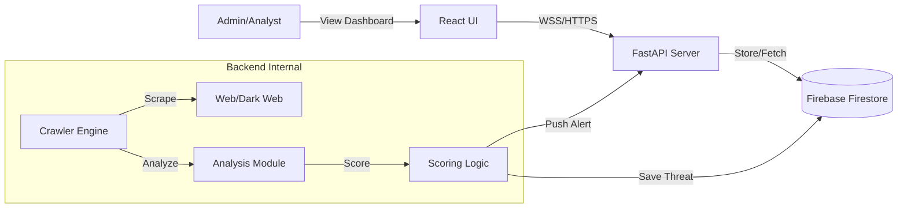

# Trinetra System Architecture (Presentation Ready)

Here is a structured breakdown perfect for copying into PowerPoint slides.

---

## Slide 1: High-Level Architecture
**Title**: 3-Tier Microservices-Ready Architecture

*   **Frontend (Presentation Layer)**:
    *   **React + TypeScript**: Highly responsive, type-safe UI.
    *   **Real-time Dashboard**: Live updates via WebSockets.
    *   **Component-Based**: Modular design using Tailwind CSS.

*   **Backend (Application Layer)**:
    *   **FastAPI (Python)**: High-performance, asynchronous REST API.
    *   **Modular Services**: Decoupled Crawler, NLP Engine, and API logic.
    *   **Scalable**: Built to handle concurrent scraping and analysis.

*   **Database (Data Layer)**:
    *   **Firestore (NoSQL)**: Serverless, scalable document storage.
    *   **Real-time Sync**: Native support for live data listeners.
    *   **Flexible Schema**: Adapts to evolving threat data structures.

---

## Slide 2: Data Ingestion Pipeline (The "Eyes")
**Title**: Multi-Source Threat Intelligence Gathering

*   **Parallel Execution**:
    *   Powered by Python `asyncio`.
    *   Scrapes multiple sources simultaneously (non-blocking).

*   **Source Adapters**:
    1.  **Reddit Scraper**: Monitors `r/netsec`, `r/hacking` via JSON API.
    2.  **Pastebin Scraper**: Scrapes latest public pastes for leaks.
    3.  **Generic Forum Scraper**: Custom CSS-selector based scraper for any website.

*   **Data Normalization**:
    *   All raw data converted to a unified `RawPost` format.
    *   Ensures consistent processing regardless of source.

---

## Slide 3: The Intelligence Engine (The "Brain")
**Title**: Two-Pass Analysis Phase

*   **Pass 1: Credential Detection (Deterministic)**
    *   **Technology**: High-performance Compiled Regex.
    *   **Capabilities**: Identifies 24+ specific patterns.
    *   **Targets**: AWS Keys, API Tokens, Database URLs, Private Keys.
    *   **India-Specific**: Aadhaar, PAN, Indian IFSC Codes.

*   **Pass 2: Contextual NLP (Probabilistic)**
    *   **Technology**: Keyword Density & Co-occurrence Analysis.
    *   **Attack Vectors**: Detects DDoS, Ransomware, SQLi discussions.
    *   **Sector Mapping**: Automatically flags threats to Banking, Defense, Gov entities.
    *   **Entity Extraction**: Pulls IPs, Domains, and Emails from text.

---

## Slide 4: Proprietary Scoring Algorithm
**Title**: Unified Threat Scoring Model (0-100)

*   **The Formula**:
    $$ \text{Score} = (\text{NLP Severity} \times 30) + (\text{Credential Matches} \times 50) + \text{Context Bonuses} $$

*   **Key Drivers**:
    *   **Severity**: Critical/High/Medium/Low classification.
    *   **Credibility**: Confidence score to reduce false positives.
    *   **Impact**: Boosts score if Indian Critical Infra is targeted.

*   **Outcome**:
    *   Differentiates between "a casual mention of a hack" (Low) and "a leaked database password" (Critical).

---

## Slide 5: Real-Time Delivery System
**Title**: Event-Driven Alerting

*   **WebSocket Protocol**:
    *   Replaces traditional HTTP polling.
    *   **Zero Latency**: Alerts push to dashboard the millisecond they are stored.

*   **Live Dashboard**:
    *   **Dynamic Feed**: New cards appear instantly at the top.
    *   **Visual Indicators**: Color-coded severity (Red/Orange/Yellow).
    *   **Audio Alerts**: (Optional) Sound notification for Critical threats.

---

## Slide 6: Security & Scalability
**Title**: Enterprise-Ready Design

*   **Security**:
    *   **Redaction**: Sensitive keys (API secrets) are masked before storage.
    *   **Authentication**: Firebase Admin SDK for secure backend operations.
    *   **Isolation**: Crawler runs in a separate loop from API requests.

*   **Scalability**:
    *   **Stateless Backend**: Can scale horizontally (add more workers).
    *   **Serverless DB**: Firestore handles massive read/write loads automatically.
    *   **Async I/O**: Efficiently handles thousands of concurrent network requests.

---

## Slide 7: Visual Architecture Diagram
*(You can redraw this Simple Diagram in PPT)*

